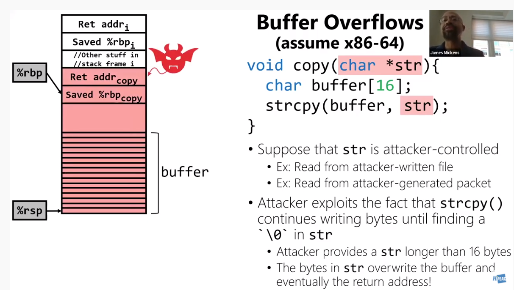

# Ret2libc

So, attacker headset back on. How can we combat the NX bit?

If we look back at our BOF example here, and we still have control over the `str` pointer

```c
void copy(char *str) {
    char buffer [16];
    strcpy(buffer, str)
}
```



### How could we attack this?

Well, remember when I talked about the libc page, and what the libc holds? That's right, it holds all the functions that a C program can access, such as `strcpy()`, `gets()`, `__libc_start_main()`, `system()`, `exit()`, `malloc()`, `...`. So, what if we could call one of these functions with any parameters we want? As the libc functions live on the stack, we can find where they are, and jump to their address, providing them with their arguments. 

For example, a common ret2libc attack would be to call `system("/bin/sh")`. This would emulate the shellcode, in the sense that we would be getting system to execute /bin/sh, which you guessed it, is how a bash shell gets started.

So, this is all based on the attacker being able to control the flow of execution. We overflow, then we overwrite the original return address with one of our own - this is known as _Code Pointer Corruption_

### Code Pointer Corruption

As we said, a buffer overflow allows an attacker to divert the control flow of the program to somewhere of their choosing. So what options do they have?

* Stack
  * Return values
  * Function pointers
  * Vptrs
* Heap
  * Function pointers
  * Vptrs

