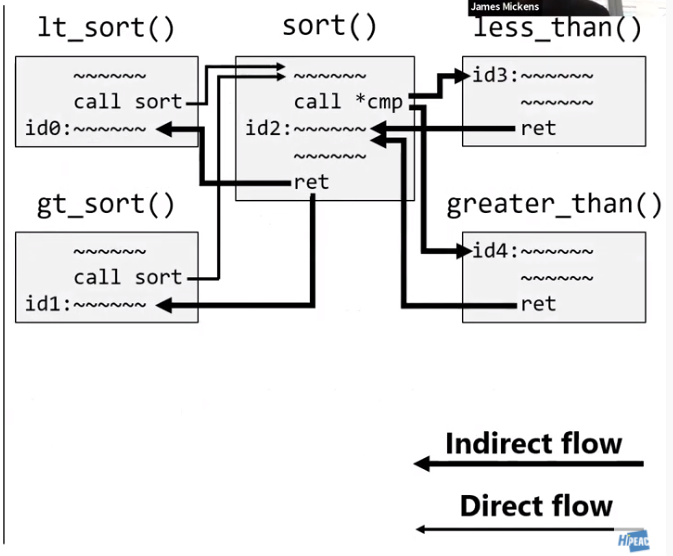

# Challenges of Precise CFG

Let's say that we had some C functions

```c
void lt_sort(int *arr, int len){
    sort(arr, len, less_than);
}

void gt_than(int *arr, int len){
    sort(arr, len, greater_than);
}
```

So these two functions do a similar thing, where they take in a pointer to an array, and a length, and then it'll call the sort function, and it'll sort the array base on that third argument, `less_than` or `greater_than`

If we take a look at the rest of the code, we get this

```c
bool less_than(int x, int y){ ... };
bool greater_than(int x, int y){ ... };

void sort(int *arr, int len, comp_func_t cmp){
    if(cmp(a[i], a[i+1])){ ... }
    ...
}
```

### Compiler enforced static CFI

So what the compiler would do is it would find every instruction that can be a legitimate target for an indirect branch, and assign each one of those a unique ID.

The copmpiler is also going to associate every indirect branch instruction with a set of valid taget IDs. The compiler will then instrument every indirect branch to determine whether the current jump is valid. So in other words, the compiler is essentially going to inject new instructions that the developer didn't put there, to introspect the jump target, and is going to ask "Hey, is this jump tagret fall on the set of valid target IDs?"

If we look at the control flow graph for the C code, you'll see something like what's below



So as you can see, we get light arrows signifying direct flow, and heavier arrows signifying indirect flow. We can tell, say the top left `lt_sort()` has a direct flow to the top of the `sort()` function because we know, with complete certainty, that we're going to be calling the `sort()` function.

 In contrast, if we look at the top of the `sort()` function, we see an indirect control flow to the `less_than()` boolean. Depending o what function was passed in as an argument, we're going to jump to one of two possible targets, either `less_than()` or `greater_than()`.

So what are some examples of Compiler-inserted CFI checks?

* `less_than()::ret` can only return to `id2`
* `sort()::call *cmp` can only jump to
  * `id3` if control flow originates from `lt_sort()`
  * `id4` if control flow originates from `gt_sort()`

 So we could saythe cheks is dependant on the control flow history

### Challenge - expensive!

Tracking cross jump control flow is expensive. This is because compiler-injected instrumentation might need to access data structures many times for each jump. So you could imagine that the compiler-injected instrumentation is actually using some type of call stack for example, to determine where a call instruction should go to. Well it could look at the stack, and say "Ok, I came through the `lt_sort()` function, so therefore the only valid target for this call is the `less_than()` boolean"

The problem here is that jumps are very common, so if we were going to check a full blown data structure for every control flow, and maintaining that data structure whenever we transfer the value of `rip` to some different value, that would be very expensive.

###  CFI impelemented in the real world?

A real compiler-based CFI often relaxes some constraints, so sometimes it will allow a control flow to happen, despite it technically not allowed by the precise control flow graph. 

For example, many compiler based control schemes allow a ret to return to any call-preceded instruction. If we look at `lt_sort()`, there's a call instruction, and then an `id0`, which is just some instruction. The instruction at `id0` is a call-preceded instruction. If we relax the control flow graph that we're trying to inforce, the copmpiler is only going to inject control flow instrumentation if a `ret` returns to a call-preced instruction. So if we take a look at `less_than()::ret`, it would not just be able to return to `sort()::id2`, but also `lt_sort()::id0`

Another common

