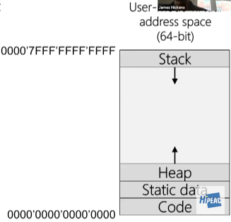
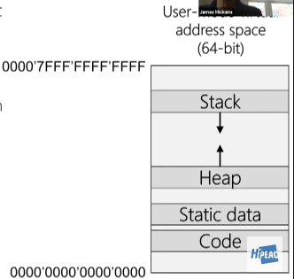

# ASLR

It is very easy, for an attacker, if they know the location of where certain aspects lie. If the locations aren't randomised throughout program execution, and that randomisation is different across executions and different machines, then the attacker can hardcode in addresses into their exploit.

Some examples of locations that attackers may want to know are:

* Location of an overflow-able buffer for a particular function on the stack, which they can include in a particular call chain
* Libc addresses which can be used in a ret2libc attack, such as `system()` and `/bin/sh`. 

If these locations don't change, then the attacker can just load up gdb or radare2 locally and seeing where they are in the binary

## So how can we divert this?

ASLR. Address Space Layout Randomisation

When the OS loads a process, the various regions which have been linked to the binary are put at random **offsets**

For example, the layout of the virtual ****mappings may look like this one time



And then they may look like this the next



The reason that the regions are randomly addressed, but at offsets, is so that the process also knows where the sections for the stack, heap, libc etc. are. These offsets, on the same machine, are the same each time. For example, on a 32 bit machine

* One time, libc may be loaded in at address 0xf7ffadc000
* The next runtime, it may be loaded in at 0xf7ffad4000

However, these offsets are completely random. For example:

* Page-boundary alignment is often required \(eg. `mmap()`\). You could, potentially, make the stack and heap not page-aligned, however that would make the kernel code, which does things like load process binaries, much more irritating, because now you're going to have bunches of chunks of memory that are going to span page boundaries. Because the guts of the kernel interface and the block device, page face, would require a lot of kernel code writing. So in practice, these segments are going to have to be page-aligned, on say 4k
* On current 64 bit Linux OS's, you get 22 bits of stack randomness

## How do you enable randomisation of code and static data?

```text
$ gcc --pie -o out program.c
```

You need to enable pie - Position Independent Executable. This doesn't use absolute addresses, and it does things like invoke call instructions, or load the value of static data variables. Instead, all of the references to the code and static data have to be indirect somehow, such as rip-relative - relative to the current pc, or maybe via table lookup: indirect via register

If you would like to enable ASLR, then that is a system-wide protection, not just for a specific binary

```c
> echo 2 | sudo tee /proc/sys/kernel/randomize_va_space
```

If you echo `2`, then that means that ASLR is on. If you echo `0`, then that means that ASLR is off

## How does ASLR work in the Linux kernel?

If we look in the kernel source file, in `mm/util.c`


```c
unsigned long randomize_stack_top(unsigned long stack_top)
{
    unsigned long random_variable = 0;
    if (current->flags & PF_RANDOMIZE){
        random_variable = get_random_long();
        random_variable &= STACK_RND_MASK; 
        // ^ 11 bits of randomness on 32-bit host; 
        // ^ 22 bits of randomness on a 64-bit host
        random_variable << PAGE_SHIFT;
    }
    return PAGE_ALIGN(stack_top) - random_variable
}
```


There is a function called `randomize_stack_top` which first checks to see if it should randomise the start location of this processes stack \(this is called when we're initially setting up the address space for a new process\). 

* We check the flags to see if we're meant to be randomising stuff \(`PF_RANDOMIZE`\)
  * If the answer is yes, then we make a call to a random number generator \(`get_random_long()`\)
  * Then we and off some bits \(`&= STACK_RND_MASK`\), giving us 11 bits of randomness on 32 bit hosts, and 22 bits of randomness on 64 bit hosts.
  * We then shift that variable to the left by the page amount \(`<< PAGE_SHIFT`\)
* Once we've done that, we take the `stack_top` that was passed in, and we move it around based on the value of `random_variable`.

If we now look in `fs/binfmt_elf.c`


```c
static int load_elf_binary(struct linux_binrpm *bprm)
{
    if ((current->flags & PF_RANDOMIZE) && 
    (randomize_va_space > 1)) {
        mm->brk = mm->start_brk = arch_randomize_BRK(mm);
    }
}
```


Once again, we see that this a function that is called by the kernel when it's initialises the address space. We see something similar here with randomising`brk`.

The `brk` is the start for the heap, so here we're saying:

* Should we be randomising the start of the heap?
  * If so, then the start of the heap is going to be in some randomised offset during code execution

