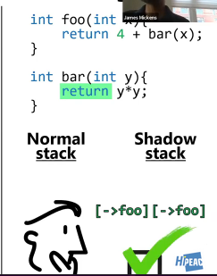

# Intel CET

## What is it?

It stands for **Intel Control-Flow Enforcement Technology**, and it ships with:

* Tiger Lake chips that are coming out in 2021
* Upcoming Xeon chips

## Shadow Stacks

One thing that Intel's CET provides is this notion of a shadow stack. The shadow stacks are a separate, hardware managed stack which traces `call` and `ret` info.

The basic idea is pretty simple:

* During a `call` instruction, the **hardware itself**, not the OS, is going to `push` the address of the instruction after the call onto the shadow stack.

  * The reason that it's the address after the `call` is because that's where the function should return to


* During a `ret` instruction, **the hardware** again is going to `pop` the addresses from the shadow stack **and** the regular stack, and is going to check to see whether they match. 
  * If they don't match, then the CPU will raise a Control Protection Exception, and then OS terminates the process



### Where do Shadow stacks live?

Intel's implementation of CET, the shadow stack lives in virtual memory. You don't have to implement the shadow stack like this. You could imagine that the shadow stack live in some sort of hardware buffer, that isn't part of the virtual memory space, and that is only used for shadow stack stuff.

### Well if it lives in virtual memory, can it be attacked?

As it turns out, Intel has figured this out that an attacker can try and tamper with it, so the CET protects the shadow stack using page table protection. By setting the protections correct on the shadow stack means that the only instructions that can modify the shadow stack are the `call` and the `ret.`However, there are some other instructions that can manipulate the shadow stack: `saveprevssp` and `rstoressp`:

* Save and restore a shadow stack pointer
* Useful for context-switching between shadow stacks

`incssp`

* Remove shadow stack entries with no `ret`

  * There are some situations where userland code needs to do some non-local returns, ie. returns that don't correspond to return addresses on the stack
  * Common example is Language-level exception handling
    * `try .. catch` blocks
  * When we implement these, we get to do what's called _unwinding the stack._
  * Often, you would unwind the stack which would otherwise seem unnatural

### How can it be implemented?

```text
$ gcc -fcf-protection -o out program.c
```

`-fcf-protection` has a couple of levels:

* `-fcf-protection=branch`: tells compiler to implement checking of validity of control-flow transfer at the point of indirect branch instructions, ie. `call/jmp` instructions
* `-fcf-protection=return`: implements checking of validity at the point of returning from a  function
* `-fcf-protection=full`: an alias for specifying both "branch" and "return"
* `-fcf-protection=none`: turns off instrumentation

## Indirect branch tracking

IBT introduces the instruction `endbranch` which essentially evaluates to a `nop` instruction on older CPUs. So that means if you try to compile programs with IBT support on pre-Xeon chips, there'll be no harm done as it just converts it to a `nop`.

This isn't going to do anything itself, however the hardware is going to ensure that any `jmp` or `call` target is an `endbranch`. SO the `endbranch` instructions acts as an indicator that this address is a valid target for a `jmp` or `call`.

```cpp
       |
       |             /----------\
       v             |          v
+--------------+     |   +--------------+
|   endbranch  |     |   |  endbranch   |
+--------------+     |   +--------------+
| mov rbx, rax |     |   | sub r10, r9  |
+--------------+     |   +--------------+
| add rcx, rax |     |   | mul rax, r11 |
+--------------+     |   +--------------+
| xor rcx, r11 |     |   |     ret      |
+--------------+     |   +--------------+
|    jmp r9    |     |
+--------------+     |
       |             |
       \_____________/
```

So this control flow would be allowed, as we see that the direction that we're going, is going to an `endbranch`. However, if we had something like this

```cpp
       |
       |             
       v                        
+--------------+          +--------------+
|   endbranch  |          |  endbranch   |
+--------------+          +--------------+
| mov rbx, rax |     /--> | sub r10, r9  |
+--------------+     |    +--------------+
| add rcx, rax |     |    | mul rax, r11 |
+--------------+     |    +--------------+
| xor rcx, r11 |     |    |     ret      |
+--------------+     |    +--------------+
|    jmp r9    |     |
+--------------+     |
       |             |
       \_____________/
```

This wouldn't be allowed, as it's the jump isn't directly followed by an `endbranch`. IBT will then signal, which would most likely indicate that a ROP or JOP attack is happening. It would then chuck an error, and the OS would take over.

It is possible for a compiler to prefix a `jmp` or `call` instruction with a `3EH` prefix, which means "no-track". This will ignore the `jmp` or `call` to a target if it's been prefixed with that.

### How to use IBT

You have to set some configuration registers up:

* The ""master enable bit" `%cr4.cet` 
* "User-mode IBT enable bit" `%ia32_u_cet.endbr_en`

You also have to use a compiler which inserts `endbranch` at each potential indirect jump target.

A program can the be compiled with the `-fcf-protection=[full|branch|return|none]`, the same as with shadow stacks.

### A bit more

IBT provides relaxed CFI \(Control Flow Integrity\) - any given `jmp` or `call` can go to _any_ valid `jmp` or `call` target.

As an attacker, you could possibly leverage this to still use ROP and JOP attacks. Well you're correct, if you can find enough `endbranch`-preceded gadgets. However, this does raise the difficulty bar for attackers, as you've got to muck around with getting enough gadgets so that you're exploit can fully work. If you could also combine IBT with ASLR, NX bits, stack canaries etc. you're going to make it a lot more difficult to exploit.

